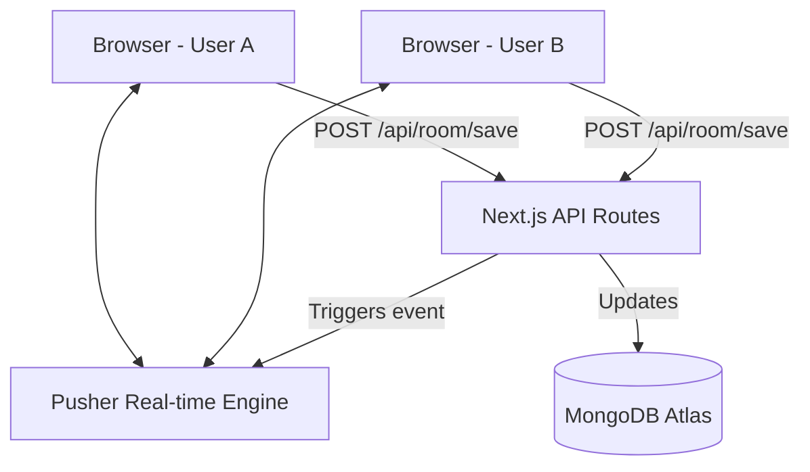

# DevSync Architecture & Workflow

DevSync is a real-time collaborative development environment that allows multiple users to code together and draw on a shared canvas.

## 🏗️ Technical Stack

- **Frontend**: [Next.js](https://nextjs.org/) (App Router), [Tailwind CSS](https://tailwindcss.com/)
- **Editor**: [Monaco Editor](https://microsoft.github.io/monaco-editor/) (via `@monaco-editor/react`)
- **Canvas**: Custom SVG-based drawing engine
- **Real-time**: [Pusher](https://pusher.com/) (WebSockets)
- **Database**: [MongoDB](https://www.mongodb.com/) with [Mongoose](https://mongoosejs.com/)
- **Infrastructure**: [Docker](https://www.docker.com/) & [Docker Compose](https://docs.docker.com/compose/)

---

## 🛠️ System Architecture

### 1. Persistence Layer (MongoDB)
- **Models**: The `Room` model (`/models/Room.ts`) stores `roomId`, `code`, `language`, and `elements` (for the canvas).
- **Connection**: Managed via `lib/mongodb.ts` with connection pooling and caching.

### 2. Real-time Layer (Pusher)
- **lib/pusher.ts**: Initializes both the `pusherServer` (for sending updates) and `pusherClient` (for receiving them).
- **Events**:
    - `code-update`: Triggered when code or language changes.
    - `canvas-update`: Triggered when drawing elements are added/deleted.

### 3. Client Components
- **RoomClient**: The main logic hub for a session. Manages UI state like `showWhiteboard` and `expandedCanvas`.
- **Editor**: Wraps Monaco Editor. Handles language selection, code execution, and Pusher subscriptions.
- **Canvas**: An SVG-based drawing component with tools for Pencil, Line, Shapes, and Eraser.

---

## 🔄 Workflow / Life of a Request

### Phase 1: Joining a Room
1. User navigates to `/Room/my-secret-room`.
2. `RoomClient` mounts and triggers a `useEffect` to fetch existing data from `/api/room/save?roomId=my-secret-room`.
3. Data is loaded into the Editor and Canvas state.

### Phase 2: Making Changes
1. **User A** types code in the Editor or draws on the Canvas.
2. An **Auto-save** timer (1-2 seconds) triggers.
3. A `POST` request is sent to `/api/room/save` with the new state.

### Phase 3: Synchronizing
1. The API route updates the MongoDB document.
2. The API route calls `pusherServer.trigger()` to broadcast the change to the `room-my-secret-room` channel.
3. **User B**'s browser receives the event via `pusherClient`.
4. The `useEffect` in User B's component updates the state (`setCode` or `setElements`), but **skips** the auto-save trigger to prevent infinite loops (using a `ref` check).

---

## 🐳 Docker Setup

- **devsync-app**: The Next.js frontend and backend service.
- **devsync-db**: Local MongoDB instance (optional, currently configured to use Atlas).
- **Volumes**: Persistent storage for MongoDB data and `node_modules`.
